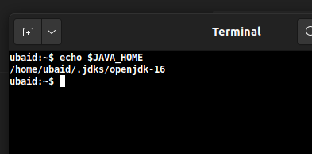
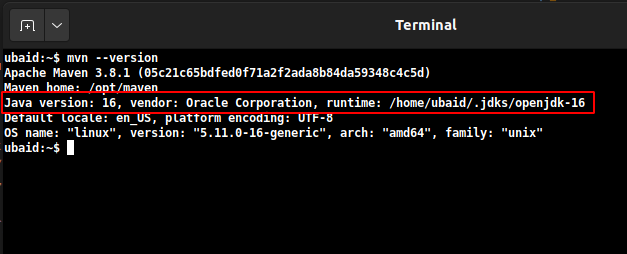
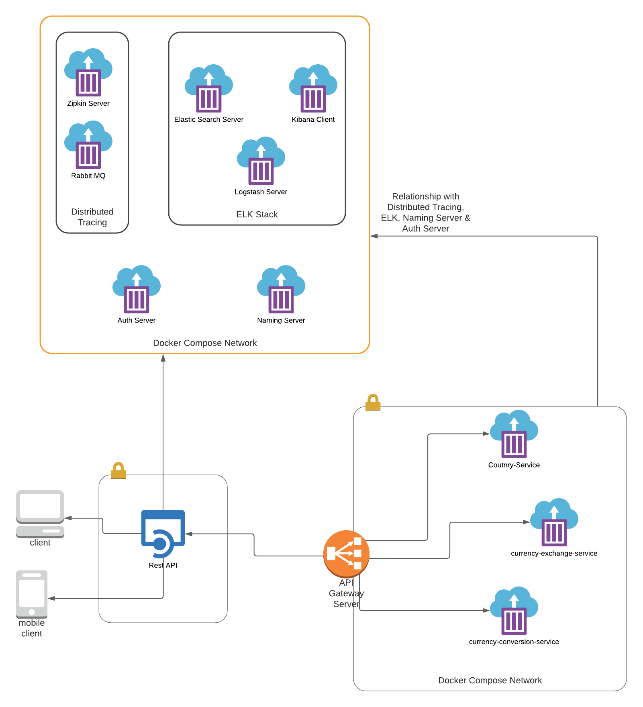

Abstract
========
- This repo represents a basic currency conversion cloud native-app which convert currency from given country code to targeted country code.
- I am using the following stack for this cloud native app.   
    - **micro-service Architecture with Gateway-Server along with Discovery Server**
    - **Spring Cloud Security OAuth2 With KeyCloak Server**
    - **ELK Stack**
    - **Distributed Tracing**
- Following are the Tools and technologies which I am using:
  - Java 16
  - Spring Boot 2.4.4
  - Spring Cloud 2020.0.2 (Security, Config Server, Service Discovery and Distributed Tracing)
  - ELK Stack Version 7.10.0
  - KeyCloak Server (Authorization Server) 12.0.1
    
Auth Flow
=========
- [Please visit here](resource/auth/auth-flow.md)

Requirements
-----------
- [Maven 3.8.1 or later](resource/install-require-softwares.md#install-maven-and-jdk-16)
- [Docker 19.03.13 or later](resource/install-require-softwares.md#install-docker)
- [JDK 16 or later](resource/install-require-softwares.md#install-maven-and-jdk-16)
- Notes: 
    - make sure`JAVA_HOME` pointing to `jdk-16` directory like below:
        
    - make sure `MAVEN` pointing to correct `jdk` which is `jdk-16` like below:
        
        
How to Run
----------
-   ``` git clone https://github.com/UbaidurRehman1/Cloud-Native-App-Spring-Boot```
-   ``` cd Cloud-Native-App-Spring-Boot```
-   ```mvn clean install -DskipTests```
-   ```cd envcn```
-   ```./run.sh``` (it will run all tools which our services needs such as keycloak server, naming server, databases, zipkin, rabbitmq and elk-stack)
-   ``` cd ..```
-   ``` ./run.sh ``` (it will up the micro-services)


About
----
- This App basically converts a currency from given country code to targeted country code by following the **cloud native approach**.
- `api-gateway` provides a gateway for end clients (web browsers, mobiles) to interact the resource servers (micro-services) 
- An Actor (React Client, React Native Client) can interact with the micro-services through the `api-gateway`
- 
- In above diagram, We can see:
    - An End Client can access the resource servers through the `api-gatewy`
    - There are four resource servers:
      1. `api-composer` abstract the functions of getting exchange rate and converting this exchange rate by the help of `currency-exchange-service` and `currency-conversion-service`
      2. `currency-exchange-service` return the exchange rate between two currencies.
      3. `currency-conversion-sevice` convert the currency to another currency using the exchange rate.
      4. `country-service` return all countries
    - An `api-gateway` which exposes its URLs to Clients
    - ELK Stack, for Centralized Logging
    - Auth Server (For OAuth2 Authentication and Authorization)
    - Naming Server (For services discovery)
    - Distributed Tracing Stack, for request tracing in micro-service architecture
  

[Swagger UI](resource/how-to-use-swagger.md)
----------

[Distributed Tracing](http://localhost:9411/zipkin/)
-------------------

Kibana Dashboard (For Centralized Logging)
------------------------------------------
- [Create Index for logging](resource/create-index-for-logging.md)
- [Go here to view centralized logs](http://localhost:5601/app/discover#)


Micro-Services
--------------
-   [API Composer](http://localhost:8755/swagger-ui/index.html?urls.primaryName=api-composer)
-   [Currency Exchange Service](http://localhost:8755/swagger-ui/index.html?urls.primaryName=currency-exchange-service)
-   [Currency Conversion Service](http://localhost:8755/swagger-ui/index.html?urls.primaryName=currency-conversion-service)
-   [Country Service](http://localhost:8755/swagger-ui/index.html?urls.primaryName=country-service)
-   [User Service](http://localhost:8755/swagger-ui/index.html?urls.primaryName=user-service)
-   [API Gateway](http://localhost:8755/actuator/health)

Servers
-------
-   [NAMING SERVER](http://localhost:8761/)
-   [CONFIG SERVER](http://localhost:8888/actuator/health)
-   [ZIPKIN SERVER](http://localhost:9411/zipkin/)
-   [RABBIT MQ SERVER *Username & Password: guest*](http://localhost:15672/)

Config Repo
-----------
- [Public Config Repo](https://github.com/UbaidurRehman1/public-repo)

Note
----
- You can read about each micro-service by going inside each folder
- [To get More info about this repo](moreinfo.md)
