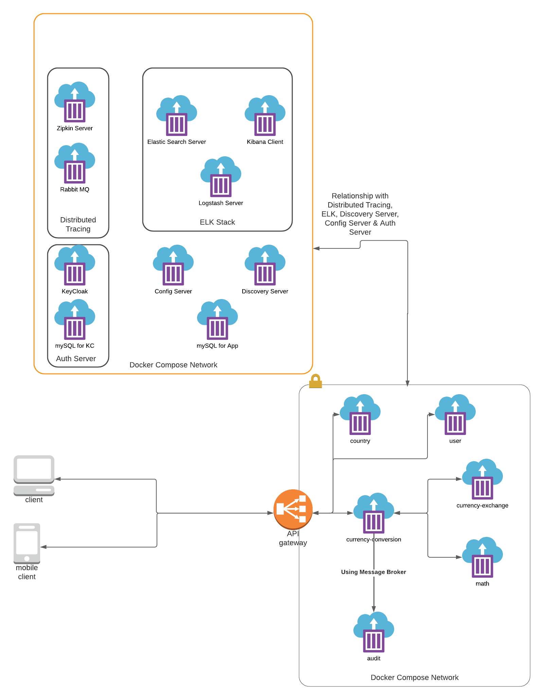

Abstract
--------
- This repo represents a basic currency conversion cloud native-app which convert currency from given country code to targeted country code.
- I am using the following stack for this cloud native app.   
    - **Microservice Architecture with API-GATEWAY along with Discovery Server**
    - **Spring Security with OAuth2 and KeyCloak Server**
    - **ELK Stack**
    - **Distributed Tracing**
- Following are the Tools and technologies which I am using:
  - **Java 17**
  - **Spring Boot 2.6.4**
  - **Spring Cloud 2021.0.1 (Security, Config Server, Service Discovery and Distributed Tracing)**
  - **KeyCloak Server (Authorization Server) 16.1.1**
  - **Zipkin Version 2.23.16 (Distribute Tracing)**
  - **Rabbit MQ Version 3.9.13-management(Message Broker)**
  - **ELK Stack Version 7.17.1**
    
Requirements
-----------
- Add the line `127.0.0.1 auth-server` in the last of your hosts file.
    - For Linux/Unix based system, its location is at: `/etc/hosts`
    - For Windows, its location is at: `c:\Windows\System32\Drivers\etc\hosts`
- [Docker 20.xx.x or later](resource/install-require-softwares.md#install-docker)
        
How to Run: [Watch Video](https://youtu.be/DyQ7gzR18Iw)
----------
- `git clone https://github.com/UbaidurRehman1/Cloud-Native-App-Spring-Boot`
- `cd Cloud-Native-App-Spring-Boot/envcn`
- `./run-multi-stage.sh` (it will run all tools which our services needs such as keycloak server, discovery server, databases, zipkin, rabbitmq and elk-stack)
- `cd ..`
- `./run-multi-stage.sh` (it will up the microservices)
- [Access Web Client UI](http://localhost:3000)
- [Access Swagger Client UI](http://localhost:8755/swagger-ui/index.html)
    - To authorize the requests in Swagger, [please follow this](resource/how-to-use-swagger.md)

[Run in Kubernetes](k8s/docx/readme.md)
-----------------

About
----
- This App basically converts a currency from given country code to targeted country code by following the **cloud native approach**.
- `api-gateway` provides a gateway for end clients (web browsers, mobiles) to interact the resource servers (micro-services) 
- An Actor (React Client, React Native Client) can interact with the micro-services through the `api-gateway`
- 
- In above diagram, We can see:
    - An End Client can access the resource servers through the `api-gatewy`
    - There are five resource servers:
      1. `currency-conversion` service abstract the functions of getting exchange rate from `currency-exchange` service and converting this exchange rate by the help of `math` service.
      2. `currency-exchange` service return the exchange rate between two currencies.
      3. `math` service convert the currency to another currency using the exchange rate.
      4. `country` service return all countries
      5. `user` service is related about user information
    - An `api-gateway` exposes its URLs to Clients
    - `Keycloak` Server (For OAuth2 Authentication and Authorization)
    - `Discovery` Server (For services discovery)
    - `Distributed Tracing Stack`, for request tracing in micro-service architecture
    - `ELK Stack`, for Centralized Logging
    - `Config Server` to get distributed app configurations (hosted in [github/public-repo](https://github.com/UbaidurRehman1/public-repo)) for each micro-service
  

[Swagger UI](resource/how-to-use-swagger.md)
----------

[Auth Flow](resource/auth/auth-flow.md)
----------

[Distributed Tracing](http://localhost:9411/zipkin/)
-------------------

Kibana Dashboard (For Centralized Logging)
------------------------------------------
- [Create Index for logging](resource/create-index-for-logging.md)
- [Go here to view centralized logs](http://localhost:5601/app/discover#)

Micro-Services
--------------
-   [API Composer](http://localhost:8755/swagger-ui/index.html?urls.primaryName=api-composer)
-   [Currency Exchange Service](http://localhost:8755/swagger-ui/index.html?urls.primaryName=currency-exchange-service)
-   [Currency Conversion Service](http://localhost:8755/swagger-ui/index.html?urls.primaryName=currency-conversion-service)
-   [Country Service](http://localhost:8755/swagger-ui/index.html?urls.primaryName=country-service)
-   [User Service](http://localhost:8755/swagger-ui/index.html?urls.primaryName=user-service)
-   [API Gateway](http://localhost:8755/actuator/health)

Servers
-------
-   [AUTH SERVER](http://localhost:9999)
-   [NAMING SERVER](http://localhost:8761/)
-   [CONFIG SERVER](http://localhost:8888/actuator/health)
-   [ZIPKIN SERVER](http://localhost:9411/zipkin/)
-   [RABBIT MQ SERVER *Username & Password: guest*](http://localhost:15672/)

Config Repo
-----------
- [Public Config Repo](https://github.com/UbaidurRehman1/public-repo)

Note
----
- You can read about each micro-service by going inside each folder
- [To get More info about this repo](moreinfo.md)
