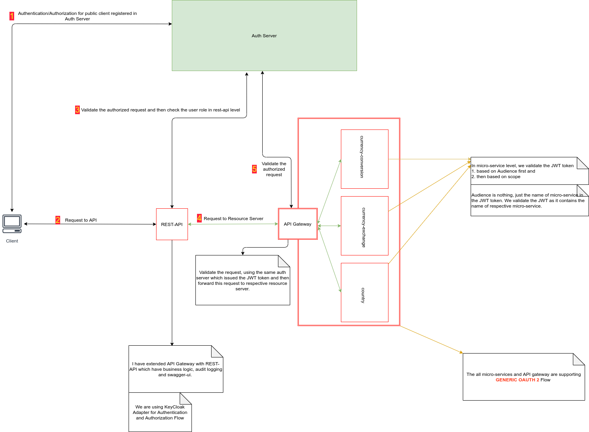
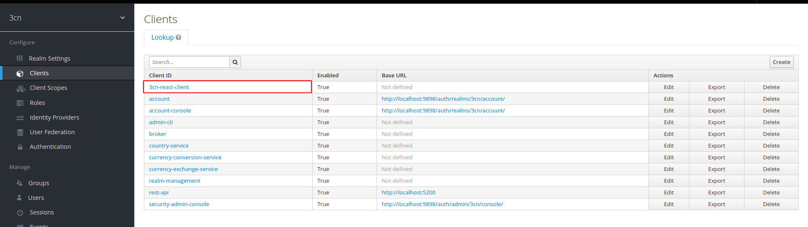
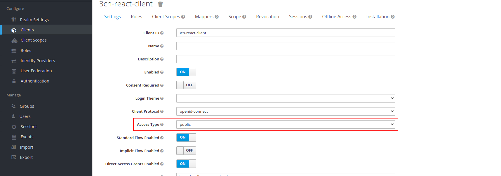

Detail:
======
1. For User End Clients (Like web browser), We have registered a public client (**3cn-react-client**) in KC auth server. When a user login into the web browser, then first it redirects to KC server login page for authentication.  When a user provider correct auth credentials (username and password) then KC auth server returns an `access-token` to the end client.

   
2.This end client will create request to the `resource servers` by appending this `access-token` in `Authorization` header. 
   
3.The `resource servers` validate this access token by the help of same `Authorization Server` and then server the request.
   

Validation
==========
1. #### User Role Validation
   We are validating User Roles in `client` level.
2. #### Scope Validation
   We are validating Scopes in `resource-server` level.
3. #### Audience Validation
   We are validating Audience in `resource-server` level.