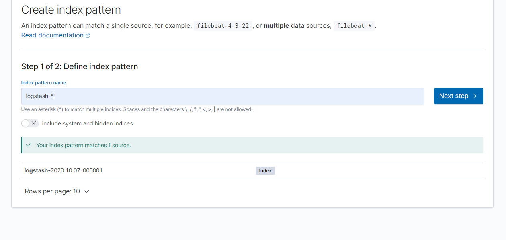
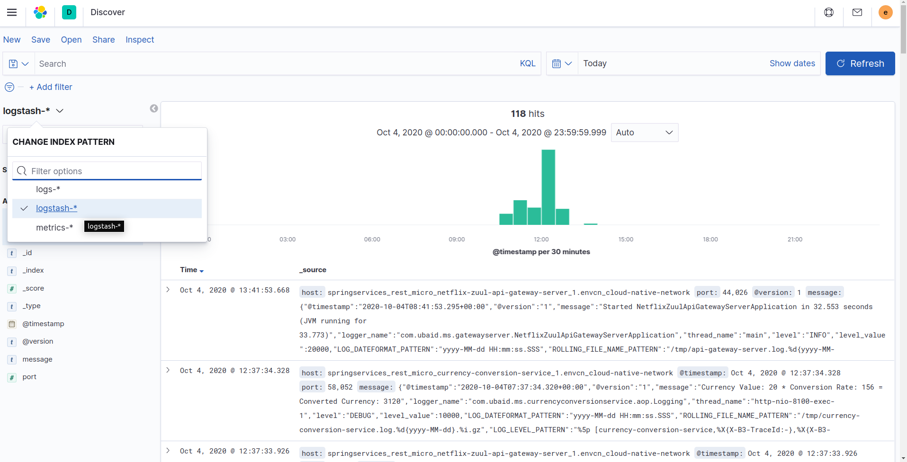

- credentials (It will ask you credentials first)
    - username : `elastic`
    - password : `changeme`
- First you have to create index `logstash-*` like below graphic.
  
- Select logstash-* index pattern like below graphic and then you will see the logs
  
