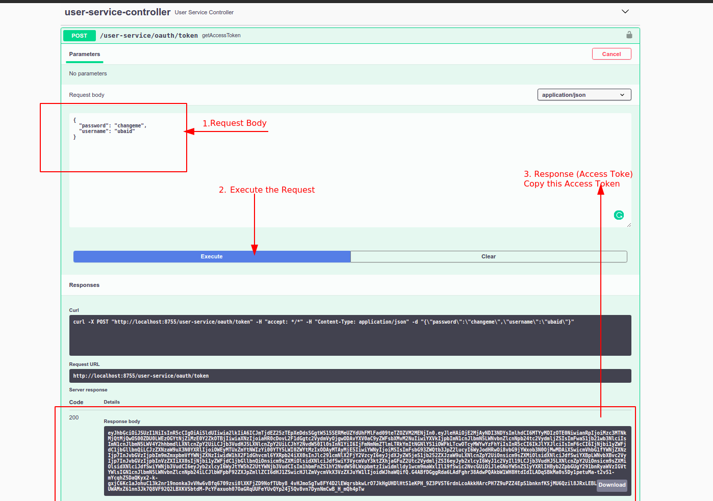
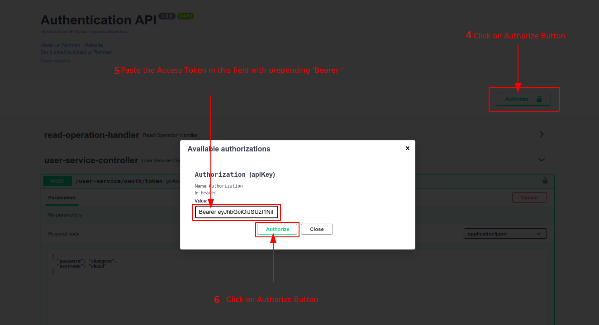
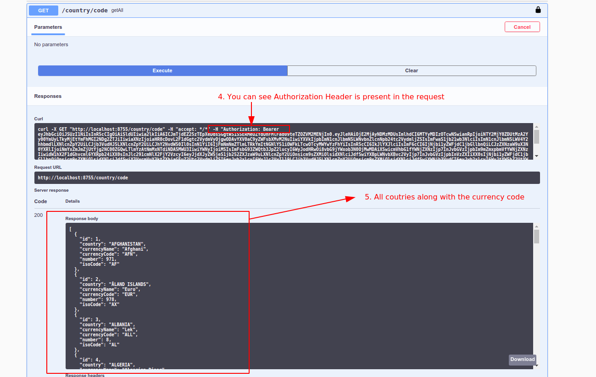
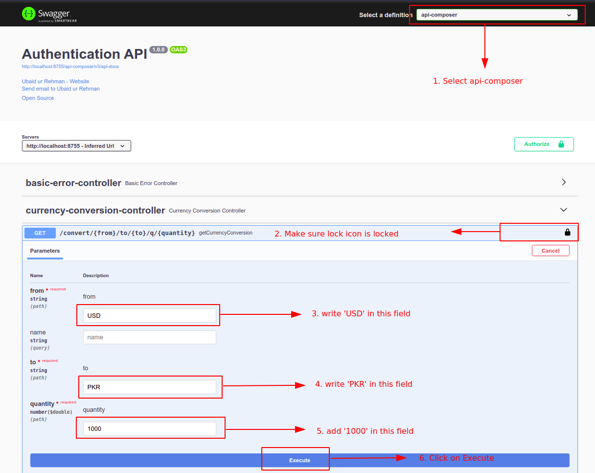
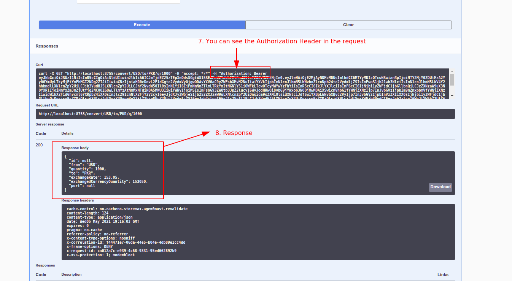
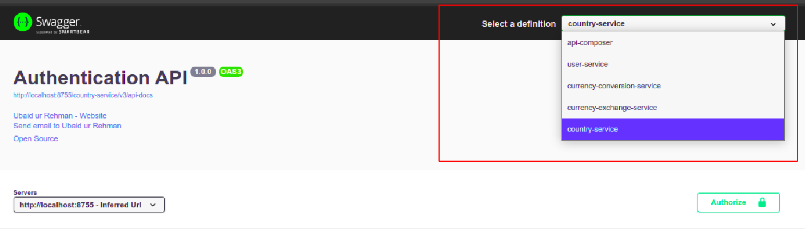

[Go to User Service Swagger UI](http://localhost:8755/swagger-ui/index.html?urls.primaryName=user-service#/user-service-controller/getAccessTokenUsingPOST) and authorize the swagger-ui by following Steps:

1. Add the request body `{"username": "ubaid", "password":"changeme"}`
2. Execute the Request
3. Copy the access token

4. Click on Authorize button in swagger UI
5. Paste the access token in the popup field and prepend the value `Bearer `. (Note: There is **space between Bearer and access token**)
6. Click on the Authorize Button. Now each request from this swagger-ui will be authorized.

   
[Country Service Swagger UI](http://localhost:8755/swagger-ui/index.html?urls.primaryName=country-service#/main-controller/getAllUsingGET)
1. Make sure Country Service is Selected
2. Make sure, the lock is locked (as locked lock depict that, request will be authorized by adding Authorization Header in the request)
3. Execute the Request

   
4. Request is authorized as swagger added Authorization header in the request.
5. We got the response from the protected resource server

   
[API Composer Swagger UI](http://localhost:8755/swagger-ui/index.html?urls.primaryName=api-composer#/currency-conversion-controller/getCurrencyConversionUsingGET)
API composer actually interacts with two micro-services and provide one end point for the end the user.

1. Make sure API Composer is selected
2. Make sure lock icon is locked
3. Add `USD` in this field (you can add any valid country code)
4. Add `PKR` in this field (you can add any valid country code)
5. Add `1000` in this field (you can add any quantity)
6. Click on execute button

   
7. You can see, this request has Authorization Header which value is same which we put in our Authorization process
8. We got the response from the protected resource server

   

Note: **You can change micro-service api docx by using this drop-down**
