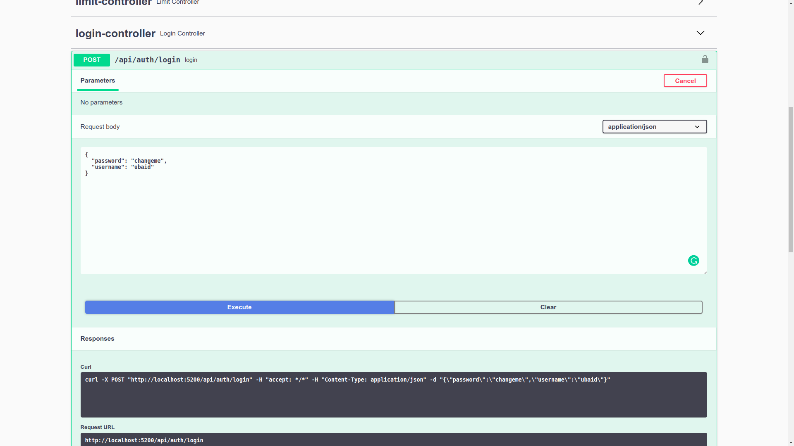
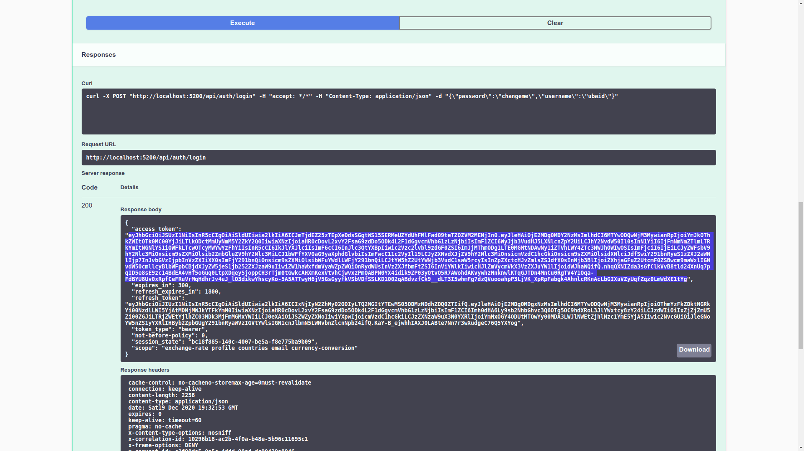
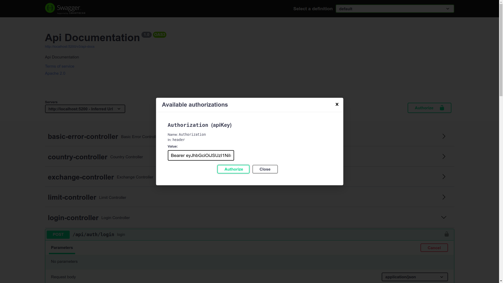
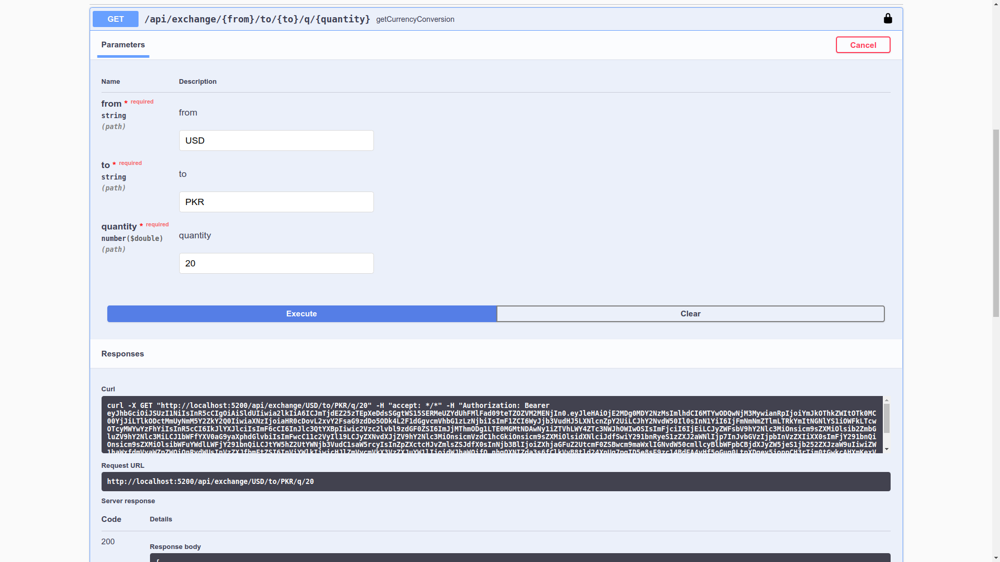
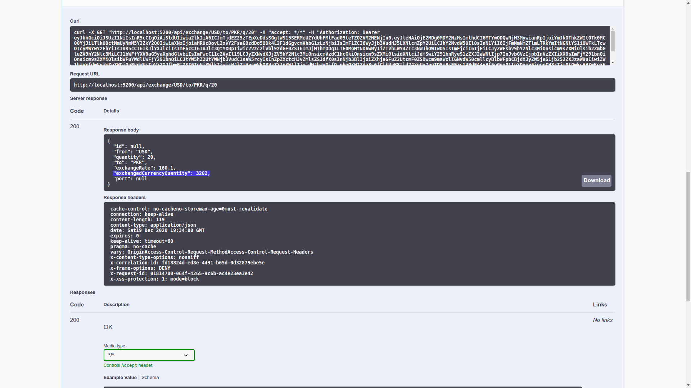

Please follow these steps:
- [Go to Swagger UI](http://localhost:5200/swagger-ui/index.html)
- Authorize Yourself in Swagger by following Steps:
    - Execute login request with body `{"username": "ubaid", "password":"changeme"}` like below
      
    - Copy the Access Token
       
    - Click on Authorize button and paste Access Token in Authorization popup prepending with `Bearer ` (Note there is space between Bearer and Access Token)
       
    - Execute a protected request like below
       
    - See the Response
        